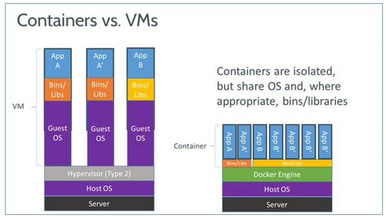
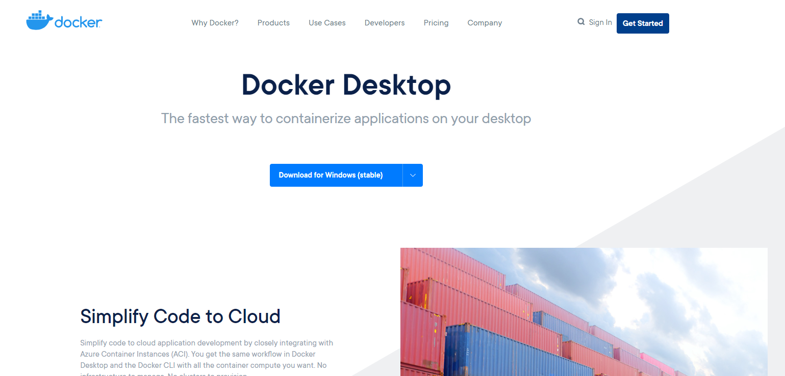
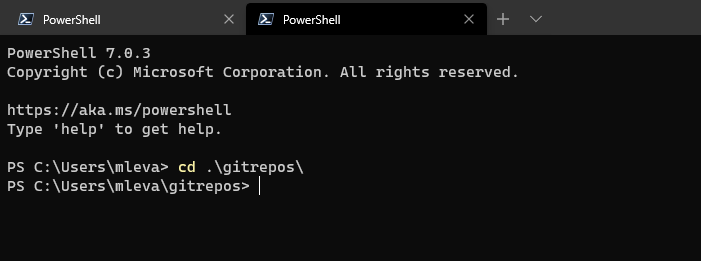
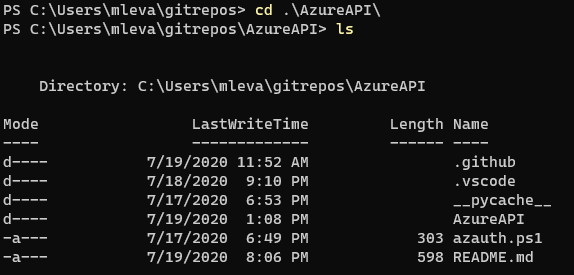
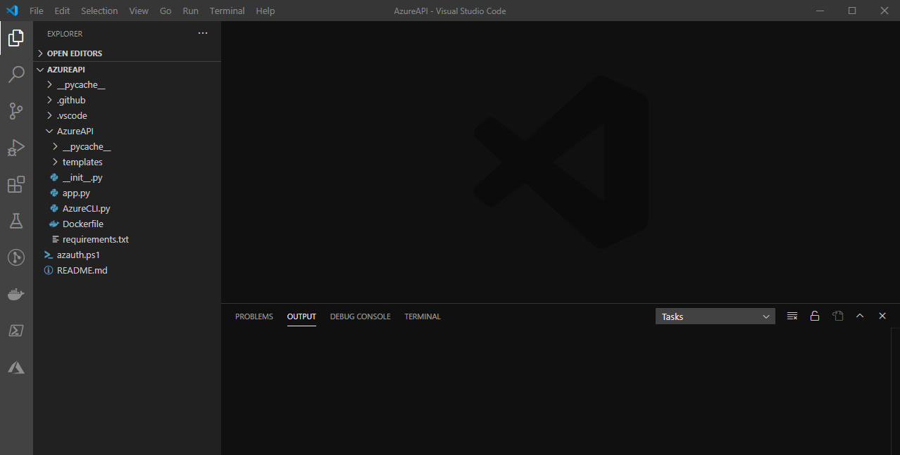
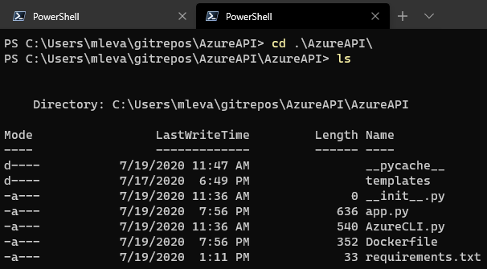
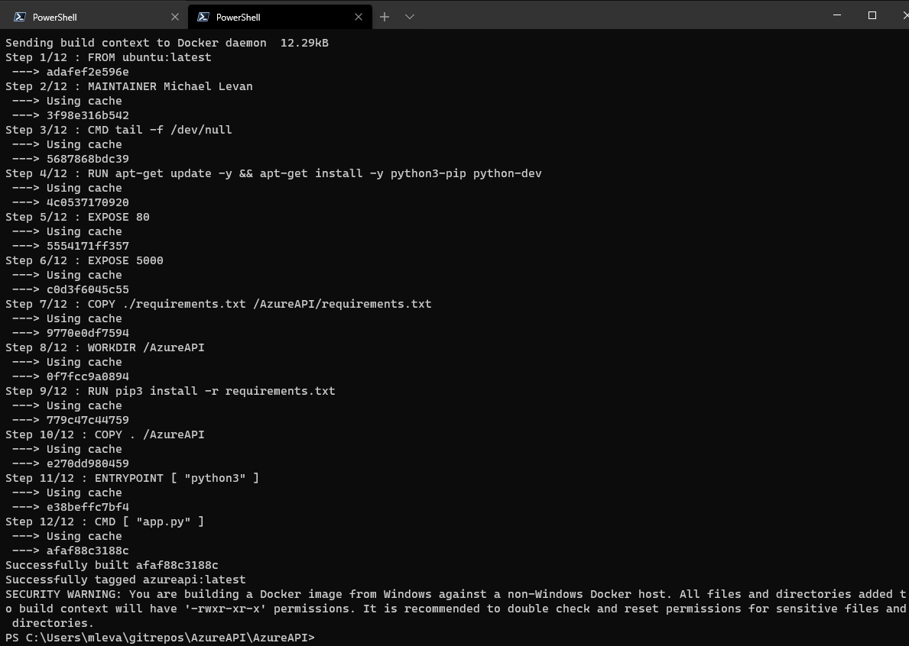
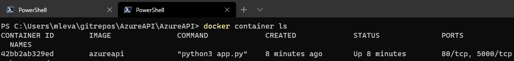

As a developer or a DevOps professional, you are constantly trying to find ways to improve applications and deployments. Whether it be moving away from virtual machines to serverless, or automating the entire continuous integration and continuous deployment (CICD) process for an organizations workload. One of the most lightweight ways to deploy an application today is by using containers, specifically, the Docker engine. Although there are plenty of other containerization engines in the world, Docker still holds true of being the most popular today.

In this blog post, you will learn how to deploy an application to a container, specifically, a Python Flask API.

## Prerequisites

To follow along and be successful in this blog post, you should have the following:

- PowerShell Core installed, which you can find [here](https://github.com/PowerShell/PowerShell).
- An understand of containers. Although we will go over Docker in this blog post, we can't go over every single topic, so it would be ideal to know the basics. You can go through the getting started guide for Docker [here](https://www.docker.com/resources/what-container).
- Git installed which you can find [here](https://git-scm.com/downloads).
- Visual Studio Code (VS Code) installed, which you can find [here](https://code.visualstudio.com/download).
- An understanding of Python. Although the code will be shown in the blog post, the blog post will not go over Python basics.

## Getting Started with Docker

Before jumping into the hands-on portion and doing labs, let's first talk about what Docker actually is and why it's useful in today's world. After that, we'll see how Docker can be installed on Windows and MacOS

### What is Docker?

Imagine you have an application that consists of a frontend, backend, and a SQL database. If you want to test the application quickly and efficiently, deploying the application to virtual machines over and over again will become cumbersome. Besides the cumbersome aspect, you also have to take into consideration the time it takes to constantly deploy the resources and what resources the deployment will consume. 

Docker takes away the hardware and virtualization levels that you may see in say, VMWare's [ESXi](https://www.vmware.com/products/esxi-and-esx.html) or Microsofts [Hyper-V](https://docs.microsoft.com/en-us/virtualization/hyper-v-on-windows/about/). Instead of having to deploy all of the hardware and virtualization resources, you can create a lightweight OS-level virtualization component that shares the same kernel as say, the server the container is running on.


Source: [https://zdnet2.cbsistatic.com/hub/i/r/2017/05/08/af178c5a-64dd-4900-8447-3abd739757e3/resize/770xauto/78abd09a8d41c182a28118ac0465c914/docker-vm-container.png](https://zdnet2.cbsistatic.com/hub/i/r/2017/05/08/af178c5a-64dd-4900-8447-3abd739757e3/resize/770xauto/78abd09a8d41c182a28118ac0465c914/docker-vm-container.png)

Containerization takes away the Guest OS and the Hypervisor layer so you don't have to worry about the management aspect of where the application is running.

From a security perspective, containers are isolated from one another even when they are running on the same system as other containers. However, you can configure them in such a way that they can communicate with each other on Dockers internal network.

I like to use this example when presenting. Think about an iPhone - it has one operating system on it, iOS, that runs several applications (phone, twitter, facebook, etc.). That one piece of hardware (the phone itself) is running one operating system (iOS). Let's say you could take an iPhone and run five or ten instances of iOS on it at the same time - that's containerization in a nutshell.

Now that you have a brief summary of what containerization and Docker is, it's time to learn how to install Docker.

### Installing Docker on Windows

On Windows, you can still Docker from the web browser.

Open up your web browser of choice and go to the Docker installation page found [here](https://www.docker.com/products/docker-desktop). Click on the Download button for the operating system you are on.



A .EXE will download and you can run through the installation with all of the default values.

### Installing Docker on MacOS

On MacOS, you can use the same method from the Installing Docker on Windows section via the UI. If you would prefer to use `homebrew`, The MacOS package manager, you can do so by opening a terminal and running the following command.

```bash
brew install docker
```

## First Look at the Python Application

Now that you understand Docker and how to install it, it's time to take a look at the Python application you will deploy to a Docker image and run on a Docker container. The Python application is a lightweight Flask API which you can find [here](https://github.com/AdminTurnedDevOps/AzureAPI/tree/master/AzureAPI).

Open up PowerShell Core, or a terminal of your choice, and change directory (`cd`) to where you would like to clone the GitHub repository.



Clone the GitHub repository so you can use it to build the Docker image. The repository can be cloned with the following command and repository URL:

```bash
git clone https://github.com/AdminTurnedDevOps/AzureAPI.git
```

`cd` into the cloned repository so you can open it in Visual Studio Code to start building the Docker image.



Once you are in the repository with the Python Flask API, you can open the code in Visual Studio Code by running the following command:

```bash
code .
```

Once `code .` is run, you will see Visual Studio code open similar to the screenshot below.



Open the `[app.py](http://app.py)` so you can see the Flask API that is being deployed to a Docker image. The Flask API consists of two routes:

- A home page.
- A route to list VMs inside of an Azure account.



## Writing a Dockerfile

In the previous section you cloned the `AzureAPI` repository found in GitHub to ensure you have the code locally so the Docker image can be built and the code can exist inside of the Docker image. In this section, you'll learn how to create that Docker image with a Dockerfile.

A Dockerfile is a step-by-step way that you can define how the application should look and be deployed. It's a list of instructions built in code.

### Building the Dockerfile

The Dockerfile is a list of steps for how the application should look inside of the Docker image and how it should be interacted with when the Docker image is deployed to a Docker container.

Below you will find the Dockerfile. Let's go over each step and see what's happening.

- `FROM` is a keyword to say *What Docker image am I basing my image off of*? In this case, it's based off of the standard Ubuntu image
- `MAINTAINER` is to tell the world and your peers who wrote the Dockerfile and who is maintaining it.
- `CMD` is for any command that you want to run on the container when the container starts.
- `RUN` let's you execute commands inside of the Docker image when it's being built.
- `EXPOSE` tells the Docker image what ports should be open from a networking perspective when the container is running.
- `COPY` allows you to copy directories or files to a certain location inside of the Docker image.
- `WORKDIR` sets your working directory.

```bash
FROM ubuntu:latest

MAINTAINER Michael Levan

CMD tail -f /dev/null

RUN apt-get update -y && apt-get install -y python3-pip python-dev

EXPOSE 80
EXPOSE 5000

COPY ./requirements.txt /AzureAPI/requirements.txt

WORKDIR /AzureAPI

RUN pip3 install -r requirements.txt

COPY . /AzureAPI

ENTRYPOINT [ "python3" ]
CMD [ "app.py" ]
```

Save the Dockerfile under the `AzureAPI` directory. If you cloned down the GitHub repository however, the Dockerfile will already exist.

### Building the Docker Image

Now that the Dockerfile is built, it's time to create a Docker image. Creating the Docker image will allow you to then create a Docker container based off of the Docker image with the Python application inside of it and ready to run.

Open up PowerShell core, or a terminal of your choice, and `cd` into `AzureAPI\AzureAPI`.



From the directory, run the following command to start building the Docker image.

- The `-t` is for tag, which allows you to name the Docker image.
- The `.` is specifying *My dockerfile exists in this directory*.

```bash
docker build -t azureapi .
```

Once you run the `docker build` command, you'll see an output similar to the screenshot below.



## Deploying the Container

In the previous section, you built the Docker image so it can be used in a Docker container to utilize the lightweight Flask API. In this section you're going to see the Docker image in action by creating a container and deploying the Flask API to the container.

From the already opened PowerShell core, or terminal of your choice, you can run the `docker run` command which deploys the Docker container.

- The `-p` switch is to specify the port. The `4000` is the port running inside of the Docker container and the `80` is the port that you will use to interact with the container on your localhost.

```bash
docker run -p 4000:80 azureapi
```

Once the Docker command above is run, the Docker container will be successfully running. To see the Docker container running, you can run the `docker container ls` command to see the container up.


Congrats! You have successfully built a Docker container running a Python Flask API.

## Conclusion

Running applications and seeing how they interact with different platforms is crucial to any software company that is deploying code at any given time. Not only is it crucial to see how the application works, but how end-users will see and interact with the application in the best possible way.

In this blog post you learned how to build a Docker image and deploy a Python Flask API to a running Docker container on localhost.